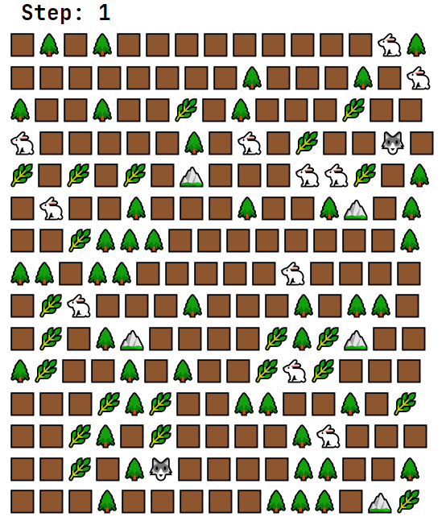

# Simulation project

---

Created according to the technical specifications presented
in [this course](https://zhukovsd.github.io/java-backend-learning-course/Projects/Simulation/)

# Overview

---
The Simulation project is a program designed to simulate the interaction of various entities on a given map.
The program allows you to create and manage objects such as hares, wolves, plants and the environment by displaying
their movements.
The implementation of the project allows you to improve your knowledge of OOP.

---
**Run**

Download the archive and run the main() method in the development environment.

---

 **Step: 1** - move counter 
 
🐇 - Herbivore

🐺 - Predator

🌿 - Grass

⛰ - Rock

🌲 - Tree

🟫 - Ground

### Implemented features:
- All map elements are added randomly.
- The main "empty" class is **Ground**.
- **Herbivore** searches for **Grass** every turn.
  When he is in proximity to Grass, he eats it. If the Grass is out of reach, then Herbivore stops performing its actions.
  It has a health indicator that decreases due to attacks by predators. There is a property of "eating grass"
- **Predator** searches for **Herbivore** every turn.
  When in proximity to **Herbivore** attacks.   If Herbivore is out of reach, then Predator stops performing its actions.
  It has the property of attack.
- **Rocks** and **Trees** do not allow creatures to pass through.
- **Grass** is food for **Herbivore**. If the Predator passes through the grass, then the grass is destroyed.

